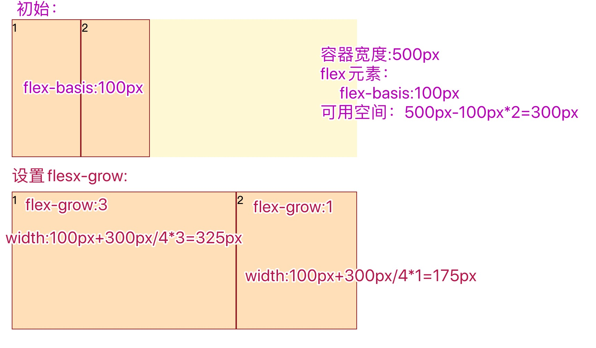
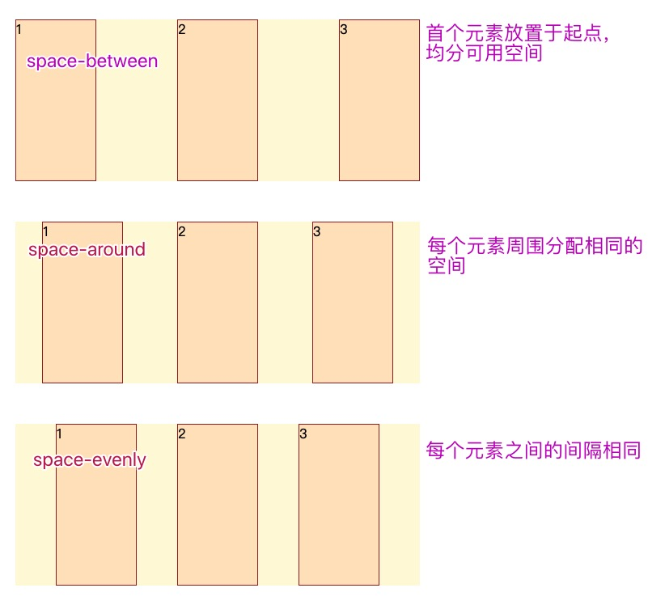

# 一、主轴和交叉轴
主轴和交叉轴垂直。

起始线和终止线：就是轴的起点和终点。

如果主轴是row，起始线是左边，终止线是右边。交叉轴的起始线是顶端，终止线是底部。

# 二、flex容器：
将一个元素的display属性设置为flex或者inline-flex，这个元素就叫做flex容器。

容器属性：

* 更改方向flex-direction
    ```
    felx-direction:row(默认)|row-reverse|column|column-reverse
    ```

    row:默认值,主轴为水平方向，起点在左端

    row-reverse:主轴为水平方向，起点在右端 （起始线和终止线交换）

    column:主轴为垂直方向，起点在上沿 

    column-reverse:主轴为垂直方向，起点在下沿 （起始线和终止线交换）

* 多行flex-wrap
    ```
    flex-wrap:nowrap(默认)|wrap|wrap-reverse
    ```

    nowrap:默认,不换行 

    wrap:换行，第一行在上方 
    
    wrap-reverse:换行，第一行在下方

* flex-direction和flex-wrap简写：flex-grow
    ```
    flex-grow:flex-direction || flex-wrap
    ```


# 三、flex元素
felx容器里面的子元素就是flex元素。

flex元素的特点：

* 元素排列为一行 (flex-direction 属性的初始值是 row)。
* 元素从主轴的起始线开始。
* 元素不会在主维度方向拉伸，但是可以缩小。
* 元素被拉伸来填充交叉轴大小。
* flex-basis 属性为 auto。
* flex-wrap 属性为 nowrap。

> 可用空间=容器宽度-元素宽度

属性：

1. flex元素在主轴上的初始大小：flex-basis
    ```
    flex-basis:width | content
    ```

    width:长度值; 相对于其父弹性盒容器主轴尺寸的百分数 。不能是负值。默认为 auto。

    content：基于flex元素的内容自动调整大小。（只有firefox支持）

    固有的尺寸关键词：fill、max-content、min-content、fit-content（只有firefox支持）

    当设置为长度值时，优先级高于width属性。当设置为content时，优先级低于width属性。

2. 分配容器剩余可用空间flex-grow

    以flex-basis为基础延展。

    > 计算方式：如果有两个flex元素分别设置flex-grow为3和1，可用空间将被分成3+1份，一个占3份，一个占1份，并与初始宽度相加。

    

3. flex元素收缩：flex-shrink

    缩小它所占空间到flex-basis以下。
    ```
    flex-shrink:number
    ```


4. flex-basis、flex-grow、flex-shrink简写：flex

    ```
    flex:<flex-grow> <flex-shrink> <flex-basis> | initial | auto | none | <positive-number>
    ```

    预定义值：

    initial：把flex元素重置为Flexbox的初始值，它相当于 flex: 0 1 auto。

    auto：等同于 flex: 1 1 auto。

    none：flex元素设置为不可伸缩。

    positive-number：flex: 1 或者 flex: 2 等等。它相当于flex: 1 1 0。元素可以在flex-basis为0的基础上伸缩。

# 四、元素间的对齐和空间分配
1. 元素在交叉轴方向对齐：align-items

    ```
    align-items: normal|stretch(默认)|center|start|end|flex-start|flex-end|self-start|self-end|baseline|first baseline|last baseline|safe center|unsafe|center
    ```


2. 元素在主轴方向上对齐：justify-content

    ```
    justify-content:center|start|end|flex-start|flex-end|left|right|baseline|first baseline|last baseline|space-between|space-around|space-evenly|stretch|safe center|unsafe center
    ```
    center:居中排列

    start:

    end:

    flex-start:从行首起始位置开始排列

    flex-end:从行尾位置开始排列

    left:

    right:

    baseline:

    first baseline:

    last baseline:
    
    space-around:均匀排列每个元素，每个元素周围分配相同的空间

    space-evenly:均匀排列每个元素，每个元素之间的间隔相等

    stretch: 均匀排列每个元素，'auto'-sized 的元素会被拉伸以适应容器的大小

    safe center:

    unsafe center

    