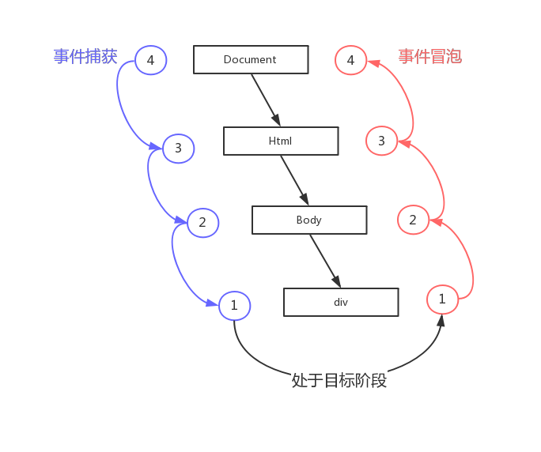

#### 事件流

> 事件流描述的是从页面中接收事件的顺序

事件流分为三个阶段：

- 事件捕获：思想是不太具体的节点应该更早接收到事件，而最具体的节点应该最后接收到事件。事件捕获的用意在于在事件到达预定目标之前捕获它。
- 处于目标阶段
- 事件冒泡：事件开始时由最具体的元素（文档中嵌套层次最深的那个节点）接收，然后逐级向上传播到较为不具体的节点（文档）。

  ```
   <!DOCTYPE html>
   <html>
   <head>
       <title>Event Bubbling Example</title>
   </head>
   <body>
       <div id="myDiv">Click Me</div>
   </body>
   </html>
  ```

   

#### 事件处理程序

> 响应某个事件的函数就叫做事件处理程序（或事件侦听器）。

1. addEventListener()和 removeEventListener()

   - 参数：要处理的事件名、作为事件处理程序的函数和一个布尔值。布尔值参数为 true，表示在捕获阶段调用事件处理程序；为 false，表示在冒泡阶段调用事件处理程序。
   - 使用 removeEventListener()来移除 addEventListener()添加的事件，参数与添加的相同，匿名函数无法移除。
   - 最好将事件处理阶段添加到冒泡阶段，可以最大限度地兼容各种浏览器。
   - 事件处理程序会在其所属元素的作用域内运行。
   - 添加多个事件，按添加顺序执行。

   ```
   //为一个按钮添加点击事件
   var btn = document.getElementById("myBtn");
   btn.addEventListener("click", function(){
       console.log(this.id);
   }, false);
   //可以添加多个事件处理程序，会按照添加顺序触发
   btn.addEventListener("click", function(){
       console.log("Hello world!");
   }, false);

   //无效。因为添加时添加的匿名函数和移除时移除的匿名函数是不同的函数
   btn.removeEventListener("click", function(){
       console.log("Hello world!");
   }, false);

   //有效的移除方式
   var btn = document.getElementById("myBtn");
   var handler = function(){
       console.log(this.id);
   };
   btn.addEventListener("click", handler, false);
   btn.removeEventListener("click", handler, false); //有效！
   ```

2. attachEvent()和 detachEvent()。

   - IE 的事件处理程序。
   - 参数：事件处理程序名称与事件处理程序函数。
   - 事件只添加到冒泡阶段。
   - 事件处理程序会在全局作用域中运行，因此 this 等于 window。
   - 可以添加多个事件处理程序，以添加顺序相反的方向执行，后添加的事件先执行。
   - 使用 detachEvent()来移除 attachEvent()添加的事件，参数与添加的相同，匿名函数无法移除。

   ```
   var btn = document.getElementById("myBtn");
   btn.attachEvent("onclick", function(){
   console.log("Clicked");
   });

   //移除
   var btn = document.getElementById("myBtn");
   var handler = function(){
       console.log("Clicked");
   };
   btn.attachEvent("onclick", handler);
   btn.detachEvent("onclick", handler);
   ```

3. 跨浏览器的事件处理程序

   ```
   var EventUtil = {
   addHandler: function(element, type, handler) {
       //检测传入的元素中是否存在 DOM2 级方法
       if (element.addEventListener) {
       element.addEventListener(type, handler, false);
       } else if (element.attachEvent) {
           //添加"on"前缀，兼容IE8
       element.attachEvent("on" + type, handler);
       } else {
           //使用 DOM0 级方法（在现代浏览器中，应该不会执行这里的代码）
       element["on" + type] = handler;
       }
   },
   removeHandler: function(element, type, handler) {
       //检测传入的元素中是否存在 DOM2 级方法
       if (element.removeEventListener) {
       element.removeEventListener(type, handler, false);
       } else if (element.detachEvent) {
           //添加"on"前缀，兼容IE8
       element.detachEvent("on" + type, handler);
       } else {
           //使用 DOM0 级方法（在现代浏览器中，应该不会执行这里的代码）
       element["on" + type] = null;
       }
   }
   };

   //使用
   var btn = document.getElementById("myBtn");
   var handler = function() {
   consolg.log("Clicked");
   };
   EventUtil.addHandler(btn, "click", handler);
   EventUtil.removeHandler(btn, "click", handler);

   ```

#### 事件对象

> 在触发 DOM 上的某个事件时，会产生一个事件对象 event，这个对象中包含着所有与事件有关的信息。包括导致事件的元素、事件的类型以及其他与特定事件相关的信息。

event 包含共同的属性或方法：
| 属性/方法 | 类 型 | 读/写 | 说 明 |
|----------|------|------|-------|
| bubbles | Boolean | 只读 | 表明事件是否冒泡 |
| cancelable | Boolean| 只读| 表明是否可以取消事件的默认行为 |
| currentTarget | Element| 只读| 其事件处理程序当前正在处理事件的那个元素（对象的 this 值始终等于 currentTarget 的值） |
| defaultPrevented | Boolean| 只读 | 为 true 表示已经调用了 preventDefault()（DOM3 级事件中新增）|
| detail | Integer | 只读 | 与事件相关的细节信息 |
| eventPhase | Integer | 只读 | 调用事件处理程序的阶段：1 表示捕获阶段，2 表示“处于目标”，3 表示冒泡阶段 |
| preventDefault() | Function | 只读 | 取消事件的默认行为。如果 cancelable 是 true，则可以使用这个方法 |
| stopImmediatePropagation() | Function | 只读 | 取消事件的进一步捕获或冒泡，同时阻止任何事件处理程序被调用（DOM3 级事件中新增） |
| stopPropagation() | Function | 只读 | 取消事件的进一步捕获或冒泡。如果 bubbles 为 true，则可以使用这个方法 |
| target | Element | 只读 | 事件的目标（事件真正的目标） |
| trusted | Boolean | 只读 | 为 true 表示事件是浏览器生成的。为 false 表示事件是由开发人员通过 JavaScript 创建的 DOM3 级事件中新增）|
| type | String | 只读 | 被触发的事件的类型 |
| view | AbstractView | 只读 | 与事件关联的抽象视图。等同于发生事件的
window 对象 |

<b>IE 中的事件对象：</b></br>
在 IE 中要使用 window.event 来访问事件对象，只有使用 attachEvent()添加的，才会有 event 对象。</br>
在 IE 中 event 包含共同的属性或方法：
| 属性/方法 | 类 型 | 读/写 | 说 明 |
|---------|-------|-------|------|
| cancelBubble | Boolean | 读/写 | 默认值为 false，但将其设置为 true 就可以取消事件冒泡（与 DOM 中 的 stopPropagation()方法的作用相同）|
| returnValue | Boolean | 读/写 | 默认值为 true，但将其设置为 false 就可以取消事件的默认行为（与 DOM 中的 preventDefault()方法的作用相同）|
| srcElement | Element | 只读 | 事件的目标（与 DOM 中的 target 属性相同）|
| type | String | 只读 | 被触发的事件的类型 |

<b>跨浏览器的事件对象</b></br>

```
var EventUtil = {
  addHandler: function(element, type, handler) {
    //省略的代码
  },
  //返回对 event对象的引用
  getEvent: function(event) {
    return event ? event : window.event;
  },
  //返回事件的目标
  getTarget: function(event) {
    return event.target || event.srcElement;
  },
  //取消事件的默认行为
  preventDefault: function(event) {
    if (event.preventDefault) {
      event.preventDefault();
    } else {
      event.returnValue = false;
    }
  },
  removeHandler: function(element, type, handler) {
    //省略的代码
  },
  //阻止冒泡
  stopPropagation: function(event) {
    if (event.stopPropagation) {
      event.stopPropagation();
    } else {
      event.cancelBubble = true;
    }
  }
};

```

#### 事件委托

当一个元素内有多个子元素需要添加事件时，可以利用事件冒泡的性质，给最外层的元素指定一个事件处理程序，来管理子元素的的所有事件。
适合添加事件委托的事件：括 click、mousedown、mouseup、keydown、keyup 和 keypress

```
 //HTML
 <ul id="myLinks">
     <li id="goSomewhere">Go somewhere</li>
     <li id="doSomething">Do something</li>
     <li id="sayHi">Say hi</li>
 </ul>

 //给ul添加事件，来管理li标签的事件
 var list = document.getElementById("myLinks");
 list.addEventListener("click", function(event) {
 //区分不同li标签，做不同的操作
 }, false);
```
