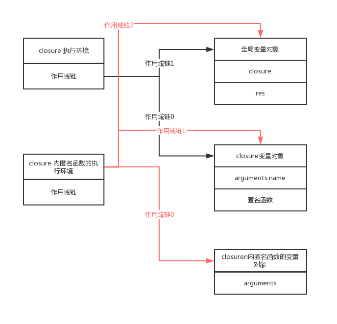

#### 递归

自己调用自己。

```
function factorial(num){
    if (num <= 1){
        return 1;
    } else {
        return num * factorial(num-1); //这种形式当把factorial()函数保存在其他变量中时，会报错
        //return num * arguments.callee(num-1);//arguments.callee 是一个指向正在执行的函数的指针，可以实现对函数的递归调用，但是在严格模式下这个属性会报错
    }
}

//在严格模式和非严格模式下都可以的方式定义递归函数：使用匿名函数
var factorial = (function f(num){
    if (num <= 1){
        return 1;
    } else {
        return num * f(num-1);
    }
});
```

#### 闭包

> 闭包是指有权访问另一个函数作用域中的变量的函数。

创建闭包的常见方式：在一个函数内部创建另一个函数。

1. 作用域链
   当我们调用一个函数时，会创建这个函数的执行环境；执行环境又称为执行上下文，他定义了变量或函数有权访问的其他数据，决定了他们的各自行为。最外围的执行环境称为全局执行环境，在 web 浏览器中，被认为是 window 对象；每个执行环境都有一个变量对象，这个对象我们是无法访问的，变量对象上保存的是当前执行环境中定义的函数和变量。当我们查找一个变量时，会先从当前执行环境的变量对象上查找，找到了则返回这个变量，如果没有找到，会去父级执行环境的变量对象上查找，知道全局执行环境的变量对象，这种形式，会形成作用域链。
   作用域链本质上是一个指向变量对象的指针列表，它只引用但不实际包含变量对象。

2. 缺点

   - 内存泄漏

   ```
   function closure(name) {
    return function() {
        console.log(name);
    };
   }
   var res = closure("小仙女");
   res();

    //解决方法
   res=null // closure()函数返回后，其执行环境的作用域链会被销毁，但它的活动对象仍然会留在内存中；直到匿名函数被销毁后，closure()的活动对象才会被销毁
   ```

   作用域链：
   

   - 闭包只能取得包含函数中任何变量的最后一个值。

   ```
   function createFunctions(){
        var result = new Array();
        for (var i=0; i < 10; i++){
            result[i] = function(){
                return i;
            };
        }
        return result;
    }
    var res=createFunctions();
    res[0]();//10
    //因为每个函数的作用域链中都保存着createFunctions()函数的变量对象，在这个对象上只有一个i，当循环结束后，createFunctions()函数返回后，变量i的值变成了10，此时每个函数都引用着保存变量 i 的同一个变量对象，所以在每个函数内部i的值都是10。

    //将上面的createFunctions()函数修改成下面的形式，可以避免返回最后一个值
    function createFunctions(){
        var result = new Array();
        for (var i=0; i < 10; i++){
            result[i] = function(num){
                return function(){
                    return num;
                };
            }(i);
        }
        return result;
    }
    //在匿名函数中有一个参数num，在调用匿名函数时，将i的值赋给了参数num，在匿名函数的内部，又创建并返回了一个访问 num 的闭包，最后数组中的每个函数都有num变量的一个副本。
   ```

   - this
     匿名函数的执行环境具有全局性，因此其 this 对象通常指向 window。
     ```
     var name = "The Window";
     var object = {
        name : "My Object",
        getNameFunc : function(){
            return function(){
                return this.name;
            };
        }
     };
     object.getNameFunc()();//"The Window"
     //getNameFunc内的this指向window，解决办法是在getNameFunc()中将this值保存在一个闭包可以访问的变量中，然后再在闭包中访问。
     ```

#### 模仿块级作用域

通过匿名函数，模仿块级作用域。减少全局变量和全局函数。

```
(function(){
 //这里是块级作用域
})();
```

以这种方式运用于闭包时，可以减少闭包占用的内存问题，因为没有指向匿名函数的引用。只要函数执行完毕，就可以立即销毁其作用域链了。

```
function outputNumbers(count){
    (function () {
        for (var i=0; i < count; i++){
            console.log(i);
        }
    })();
}
```

#### 私有变量

> 任何在函数中定义的变量，都可以认为是私有变量，因为不能在函数的外部访问这些变量。私有变量包括函数的参数、局部变量和在函数内部定义的其他函数。

> 把有权访问私有变量和私有函数的公有方法称为特权方法。

创建特权方法的方式：

```
//第一种 在构造函数中定义特权方法
//创建 MyObject 的实例后，除了使用 publicMethod()这一个途径外，没有任何办法可以直接访问 privateVariable 和 privateFunction()。
//缺点是每个实例都会创建同样一组的新方法
function MyObject(){
    //私有变量和私有函数
    var privateVariable = 10;
    function privateFunction(){
        return false;
    }
    //特权方法
    this.publicMethod = function (){
        privateVariable++;
        return privateFunction();
    };
}

//第二种 使用静态私有变量创建特权方法
//避免了使用构造函数方式，创建同样的新方法
//缺点就是所有实例共用了变量和方法
(function(){
    //私有变量和私有函数
    var privateVariable = 10;
    function privateFunction(){
        return false;
    }

    //构造函数
    MyObject = function(){};

    //公有/特权方法
    MyObject.prototype.publicMethod = function(){
        privateVariable++;
        return privateFunction();
    };
})();

//第三种 模块模式
var singleton = (function() {
  //私有变量和私有函数
  var privateVariable = 10;
  function privateFunction() {
    return false;
  }
  //特权/公有方法和属性
  return {
    publicProperty: true,
    publicMethod: function() {
      privateVariable++;
      return privateFunction();
    }
  };
})();

```
