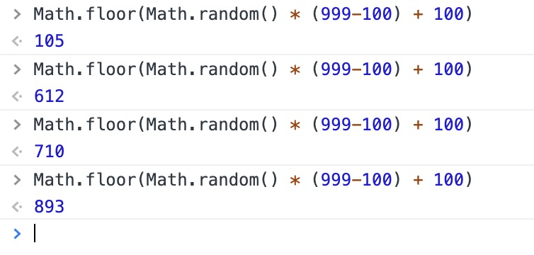

> 单体内置对象：由 ECMAScript 实现提供的、不依赖于宿主环境的对象，这些对象在 ECMAScript 程序执行之前就已经存在了。

##### Global 对象

这个对象是不存在的。

> 事实上，没有全局变量或全局函数；所有在全局作用域中定义的属性和函数，都是 Global 对象的属性。

1. URI 编码方法: </br>
   encodeURI()和 encodeURIComponent()都可以对字符进行编码。 </br>
   区别：encodeURI()不会对本身属于 URI 的特殊字符进行编码，例如冒号、正斜杠、问号和井字号和字母进行编码；encodeURIComponent()可以。 </br>
   对应的解码方式：encodeURI()对应 decodeURI()；encodeURIComponent()对应 decodeURIComponent()

   ```
   var s='我是小仙女呀， hahahah///'

   var s1=encodeURI(s)//"%E6%88%91%E6%98%AF%E5%B0%8F%E4%BB%99%E5%A5%B3%E5%91%80%EF%BC%8C%20hahahah///"
   decodeURI(s1);//"我是小仙女呀， hahahah///"

   var s2=encodeURIComponent(s);//"%E6%88%91%E6%98%AF%E5%B0%8F%E4%BB%99%E5%A5%B3%E5%91%80%EF%BC%8C%20hahahah%2F%2F%2F"
   decodeURIComponent(s2);//"我是小仙女呀， hahahah///"
   ```

2. eval() </br>
   相当于 ECMAScript 解析器，接收的参数是执行语句。
   ```
   eval("console.log('我是小仙女')");//我是小仙女
   ```
   通过 eval 执行的代码，执行环境是调用 evald 的执行环境。
   在 eval 中创建的任何变量或函数都不会提升，只有在 eval 执行的时候，才会创建。
3. window 对象 </br>
   在 Web 浏览器都是将全局对象作为 window 对象的一部分加以实现的。

#### Math 对象

1.  min()和 max() </br>
    用于确定一组数值中的最小值和最大值。

    ```
    Math.max(10,20,30,49,20);//49
    Math.min(10,20,30,49,20);//10

    //另一种使用方法
    var values = [1, 2, 3, 4, 5, 6, 7, 8];
    Math.max.apply(Math, values);//8
    ```

2.  舍入方法 </br>

- Math.ceil()执行向上舍入，即使要舍入的只小于 5，也会向上加一；
- Math.floor()执行向下舍入，即使要舍入的只大于 5，也会向上加一；
- Math.round()执行四舍五入。

```
Math.ceil(3.09);//4
Math.floor(3.9);//3
Math.round(3.5);//4
Math.round(3.2);//3
```

3.  随机数 random() </br>
    返回 0-1 直接的一个随机小数。 </br>
    从某个整数范围内随机选择一个值：

    ```
    值 = Math.floor(Math.random() * 可能值的总数 + 第一个可能的值);

    //获取一个三位数
    Math.floor(Math.random() * (999-100) + 100);//138
    ```

    

4.  属性
    | 属 性 | 说明 |
    |------|------|
    | Math.E | 自然对数的底数，即常量 e 的值 |
    | Math.LN10 | 10 的自然对数 |
    | Math.LN2 | 2 的自然对数 |
    | Math.LOG2E | 以 2 为底 e 的对数 |
    | Math.LOG10E | 以 10 为底 e 的对数 |
    | Math.PI | π 的值 |
    | Math.SQRT1_2 | 1/2 的平方根（即 2 的平方根的倒数） |
    | Math.SQRT2 | 2 的平方根 |
    | Math.abs(num) | 返回 num 的绝对值 |
    | Math.asin(x) | 返回 x 的反正弦值 |
    | Math.exp(num) | 返回 Math.E 的 num 次幂 |
    | Math.atan(x) | 返回 x 的反正切值 |
    | Math.log(num) | 返回 num 的自然对数 |
    | Math.atan2(y,x) | 返回 y/x 的反正切值 |
    | Math.pow(num,power) | 返回 num 的 power 次幂 |
    | Math.cos(x) | 返回 x 的余弦值 |
    | Math.sqrt(num) | 返回 num 的平方根 |
    | Math.sin(x) | 返回 x 的正弦值 |
    | Math.acos(x) | 返回 x 的反余弦值 |
