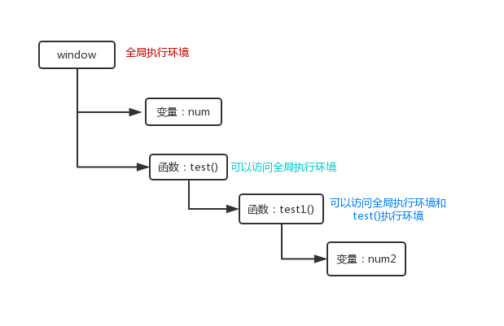

#### 基本类型和引用类型的值

    > 基本类型值：简单的数据段。</br>
    > 引用类型值：可能由多个值构成的对象。

    基本数据类型可以操作保存在变量中的实际的值。在操作引用类型时，复制某个引用类型时，实际上操作的是对象的引用，为引用类型添加属性时，操作的事实际的引用对象。</br>

    <b>复制变量</b></br>
    过程：在变量对象是创建一个新值，然后将新值分配到新的变量位置上。

    ```
    var num1=1;
    var num2=num1;
    num1=2;
    console.log(num1);//2
    console.log(num2);//1
    ```

    <b>复制引用类型</b></br>
    其实就是复制指针。

    ```
    var obj1 = new Object();
    var obj2 = obj1;
    obj1.name = "Nicholas";
    console.log(obj2.name); //"Nicholas"
    ```

#### 参数传递

    参数是按值传递的。即使参数是对象，也一样是按值传递的。

    ```
    var obj={
        x:1
    };
    function test(num){
        num.x=2;
        num={}
        num.x=3
        console.log(num.x);//3
    };
    test(obj);
    console.log(obj.x);//2
    ```

    以上示例说明对象在参数传递的过程中，是按值传递的，如果是按引用传递的，那么在函数内部，将 num 的指针指向了一个新的对象，既 x=3 的对象。可以把函数的参数看成局部变量来处理。

    #### 执行环境及作用域

    > 执行环境（环境、执行上下文）：定义了变量或函数有权访问的其他数据，决定了它们各自的行为。</br>
    > 变量对象：每个执行环境都有一个变量对象，环境中定义的所有变量和函数都保存在这个对象中。我们是无法访问这个对象的。

    全局执行环境：最外围的一个执行环境。“在 Web 浏览器中，全局执行环境被认为是 window 对象因此所有全局变量和函数都是作为 window 对象的属性和方法创建的。”

    > 作用域链：当查找一个变量时，会先从当前执行环境中的变量对象上查找，如果找不到，会从父级执行环境中的变量对象上查找，一直找到全局执行环境的变量对象。这种形式，会形成一个作用域链。

    ```
    var num=1;
    function test(){
        num=2
        console.log(num);//1 全局执行环境中包括test函数的执行环境
        //console.log(num1);执行到这里时会报错，因为在test的执行环境中和全局环境中，并没有定义num1，所以找不到这个变量，报错。
        function test1(){
            num2=3;
            console.log(num);//1
            console.log(num2);//3
        }
        test1();
    }
    test()
    ```

    

    作用域链延长：在作用域链的前端临时增加一个变量对象，可以实现作用域链的延长，这个对象在代码执行完之后，会被移除。</br>
    可以通过以下语句实现：

    - try-catch 语句的 catch 块；
    - with 语句。

    with 语句是通过将指定的对象添加到作用域链中，catch 是将创建的错误对象声明添加到作用域链中。

    在 ECMAScript 中是没有块级作用域的，当定义一个变量时，会根据最近的执行环境，将变量添加到变量对象上，如果没有通过 var 定义变量，会将变量添加到全局执行环境的变量对象上。
