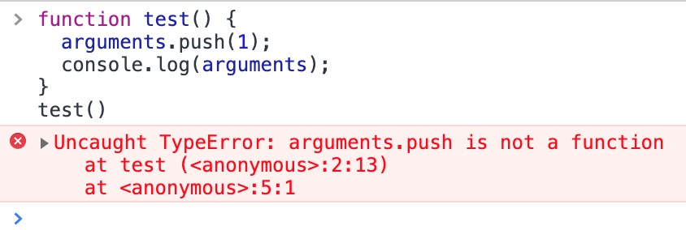

函数实际上是一个对象，函数名也就是一个指向函数的指针。 </br>
创建：

```
//函数声明法
function test(){}

//函数表达式
var test=function(){}

//构造函数（不推荐），参数不限，最后一个参数会看成是函数体，前面的都是函数的参数
new Function("num1", "num2", "return num1 + num2");
```

函数声明与函数表达式的区别： </br>
对于函数声明，有一个中药特征就是函数声明提前，解析器会先解读函数声明，这样在执行代码之前就可以访问。对于函数表达式，要等到代码执行到这个地方，才可以访问。

```
//函数声明。函数即使在最后，也可以在前面访问到函数
test();//函数声明
function test() {
  console.log("函数声明");
}

//函数表达式。会报错。
test1();
var test1 = function() {
  console.log("函数表达式");
};
```

函数调用：

```
function test(){
  return '调用成功！'
}

//调用函数
test();//"调用成功！"
//只是访问函数的指针，并不是调用函数，函数不会执行
test;

//多个函数名
var anotherTest=test;//test不加圆括号时，是将一个新的指针指向函数
anotherTest();//"调用成功！"

var anotherTest1=test();//test加圆括号之后，是将test函数的返回值赋给了anotherTest
console.log(anotherTest1);//调用成功！
console.log(anotherTest1==='调用成功！');//true
console.log(anotherTest==='调用成功！');//false
```

arguments 和 this： </br>
arguments 是函数内部的参数，是一个类数组，具有长度，不具有数组的方法。


arguments有一个属性：callee()，是一个指针，指向拥有arguments的函数。比如函数test()，可以把callee认为是函数test。在递归方法中，可以使用callee属性指回函数。

```
function num(i) {
  if (i < 5) {
    i++;
    arguments.callee(i);
  } else {
    console.log("i > 5");
  }
}
num(0);
```

this 指向的是当前函数的执行环境。

```
function test() {
  console.log(this===window);
}
test();//true
//因为test函数是在全局环境下调用的，所以this指向了全局执行环境对象，在web浏览器中，全局执行环境对象是window

var o={
  fn:test
}
o.fn();//false
//此时，引用test函数的是对象o，不再是window所有返回false

```

函数属性和方法：

1. length：表示函数接收命名参数的个数。

   ```
   function test(num,num1){};
   test.length;//2
   ```

2. prototype
3. call()、apply()、bind()

   - call()： </br>
     参数：需要绑定的 this 值，后面是需要传递的参数列表

     ```
     var x='window'
      var obj = {
      x: "obj"
     };
     function test(y) {
       console.log(this.x + y);
     }
     test.call(obj, 1);//obj1
     //修改过一次this指针之后，还可以继续修改
     test.call(this, 1);//window1
     ```

   - apply()： </br>
     参数：需要绑定的 this 值，后面是需要传递的参数列表

     ```
     var x='window'
     var obj = {
       x: "obj"
     };
     function test(y) {
      console.log(this.x + y);
     }
     test.apply(obj, 1);//obj1
     //修改过一次this指针之后，还可以继续修改
     test.apply(this, [1]);//window1
     ```

   - bind()： </br>
     参数：需要绑定的 this 值，后面是需要传递的参数列表。
     绑定 bind 后，方法不会立即执行，而是返回一个函数，需要手动调用。

     ```
     var x='window'
     var obj = {
      x: "obj"
     };
     function test(y) {
      console.log(this.x + y);
     }
     var bindTest=test.bind(obj, 1);
     bindTest();//obj1
     //修改过一次this指针之后，还可以继续修改
     var bindTest1=test.bind(this, 1);
     bindTest1();//window1
     ```
