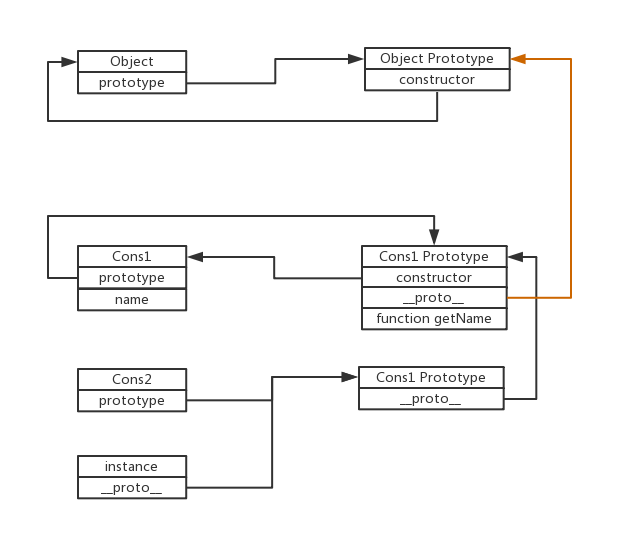

##### 对象的属性类型

1. 数据属性
   数据值的位置。
   特性：

   - [[Configurable]]：表示能否通过 delete 删除属性从而重新定义属性，能修改属性的特性，或者能否把属性修改为访问器属性。默认值为 true。
   - [[Enumerable]]：表示能否通过 for-in 循环返回属性。默认值为 true。
   - [[Writable]]：表示能否修改属性的值。默认值为 true。
   - [[Value]]：包含这个属性的数据值。读取属性值的时候，从这个位置读；写入属性值的时候，把新值保存在这个位置。默认值为 undefined。

   修改以上特性：Object.defineProperty()。

   ```
    var obj={};
    Object.defineProperty(obj,'x',{
        wrtitable:false,//控制这个属性是否可以修改，false时不可以修改
        value:'你好啊'
    });//{x: "你好啊"}
    obj.x='我很好啊';
    console.log(obj.x);//你好啊
   ```

2. 访问器属性
   包含两个函数：getter 和 setter 函数，一个负责设置值，一个负责读取值,两个属性不一定都指定，只指定 getter，属性不能读，只指定 setter，不能读，只返回 undefined，在严格模式下，这两种情况都会报错。
   特性：

   - [[Configurable]]：表示能否通过 delete 删除属性从而重新定义属性，能否修改属性的特性，或者能否把属性修改为数据属性。对于直接在对象上定义的属性，这个特性的默认值为 true。
   - [[Enumerable]]：表示能否通过 for-in 循环返回属性。对于直接在对象上定义的属性，这个特性的默认值为 true。

   * [[Get]]：在读取属性时调用的函数。默认值为 undefined。
   * [[Set]]：在写入属性时调用的函数。默认值为 undefined。

   访问器属性只能通过 Object.defineProperty()来定义。
   

3. 定义多个属性 Object.defineProperties()

```
var book = {
  x: 11
};
Object.defineProperties(book, {
  _year: {
    value: 2004
  },
  edition: {
    value: 1
  },
  year: {
    get: function() {
      return this._year;
    },
    set: function(newValue) {
      console.log("newValue:" + newValue);
      if (newValue > 2004) {
        this._year = newValue;
        this.edition += newValue - 2004;
        this.x = "修改了";
      }
    }
  }
});

```

<p style="color:red">问题：通过Object.defineProperties定义的数据属性，不能通过访问器属性修改吗？只能修改在对象上事先定义好的属性？</p>

4. 读取属性的特性 Object.getOwnPropertyDescriptor()
   收两个参数：属性所在的对象和要读取其描述符的属性名称。返回值是一个对象。
   可以针对任何对象——包括 DOM 和 BOM 对象，使用 Object.getOwnPropertyDescriptor()方法。
   

##### 创建对象

1. 工厂模式

- 抽象了创建具体对象的过程。
- 却没有解决对象识别的问题。

```
function createPerson(name, age, job){
 var o = new Object();
 o.name = name;
 o.age = age;
 o.job = job;
 o.sayName = function(){
 alert(this.name);
 };
 return o;
}
var person1 = createPerson("Nicholas", 29, "Software Engineer");
var person2 = createPerson("Greg", 27, "Doctor");
```

2. 构造函数模式

- 构造函数始终都应该以一个大写字母开头，而非构造函数则应该以一个小写字母开头。
- 缺点：每个方法都要在每个实例上重新创建一遍。
- 解决方法：提出构造函数，创建全局函数（缺点：定义很多个全局函数，没有封装性可言）

```
function Person(name, age, job){
    this.name = name;
    this.age = age;
    this.job = job;
    this.sayName = function(){
        alert(this.name);
    };

 //解决办法
 //this.sayName=sayName
}
var person1 = new Person("Nicholas", 29, "Software Engineer");
var person2 = new Person("Greg", 27, "Doctor");

//解决办法
//function sayName(){}

//person1和person2都有一个constructor（构造函数）属性，该属性指向 console.log(person1.constructor==Person);//true
console.log(person2.constructor==Person);//true
console.log(person1 instanceof Person);//true
console.log(person2 instanceof Person);//true

//缺点
console.log(person1.age===person2.age)//false


```

创建 Person 的新实例，必须使用 new，通过 new 操作符调用的函数，就是构造函数，不通过 new 调用的就是普通函数。
new 的过程：
(1) 创建一个新对象；
(2) 将构造函数的作用域赋给新对象（因此 this 就指向了这个新对象）；
(3) 执行构造函数中的代码（为这个新对象添加属性）；
(4) 返回新对象。

3. 原型模式

- 原型 prototype：每个函数都会有一个指针 prototype 指向创建他的构造函数。
- 好处：可以让所有对象实例共享它所包含的属性和方法。
- 实例上都有一个隐藏的属性`__proto__`指向创建他的构造函数的原型对象。
- 缺点：原型对象上有引用类型，实例将共享这个引用类型

```
function Person(){}
Person.prototype.name = "Nicholas";
Person.prototype.age = 29;
Person.prototype.job = "Software Engineer";
Person.prototype.sayName = function(){
 console.log(this.name);
};
var person1 = new Person();
person1.sayName(); //"Nicholas"
var person2 = new Person();
person2.sayName(); //"Nicholas"
console.log(person1.sayName==person2.sayName);//true

//判断原型对象
console.log(Person.prototype.isPrototypeOf(person1))//true
//获取原型对象Object.getPrototypeOf
Object.getPrototypeOf(person1);
console.log((Object.getPrototypeOf(person1) == Person.prototype);//true

//在实例上新增属性，同名属性只会覆盖原型上的属性，并不会修原型上的属性
person1.name='小仙女';
console.log(person1.name);//小仙女
console.log(person2.name);//Nicholas

//判断实例上是否还有某个属性
//1. hasOwnProperty()
//在person1上有重置的name属性，而person2上没有，所以可以区分哪些属性是原型上的，哪些不是
console.log(person1.hasOwnProperty("name"));//true
console.log(person2.hasOwnProperty("name"));//false
//2. in()。属性在原型上也会返回true
console.log("name" in person1);//true
console.log("name" in person2);//true
```

Person、person1、person2 关系：


for-in：返回的是所有能够通过对象访问的、可枚举的（enumerated）属性，其中
既包括存在于实例中的属性，也包括存在于原型中的属性。屏蔽了原型中不可枚举属性（即将[[Enumerable]]标记为 false 的属性）的实例属性也会在 for-in 循环中返回。
Object.keys()：取得对象上所有可枚举的实例属性，返回一个属性名字的数组。
Object.getOwnPropertyNames()：取得对象上所有的实例属性，无论是否可枚举。

```
Object.keys(Person.prototype);//["name", "age", "job", "sayName"]
Object.getOwnPropertyNames(Person.prototype);//["constructor", "name", "age", "job", "sayName"]
```

另一种写法：

```
function Person(){}
//这种写法相当于重写了prototype，所有constructor不在指向Person，而是指向了Object.
Person.prototype = {
 constructor : Person,//将constructor重新指向Person
 name : "Nicholas",
 age : 29,
 job: "Software Engineer",
 sayName : function () {}
};
```

4. 组合使用构造函数模式和原型模式

- 构造函数模式用于定义实例属性，而原型模式用于定义方法和共享的属性。
- 每个实例都会有自己的一份实例属性的副本，但同时又共享着对方法的引用，最大限度地节省了内存。

```
function Person(name, age, job){
 this.name = name;
 this.age = age;
 this.job = job;
 this.friends = ["Shelby", "Court"];
}
Person.prototype = {
 constructor : Person,
 sayName : function(){
 alert(this.name);
 }
}
var person1 = new Person("Nicholas", 29, "Software Engineer");
var person2 = new Person("Greg", 27, "Doctor");

```

5. 动态原型模式

- 把所有信息都封装在了构造函数中。
- 通过检查某个应该存在的方法是否有效，来决定是否需要初始化原型。

```
function Person(name, age, job){
  //属性
  this.name = name;
  this.age = age;
  this.job = job;
  //方法
  //sayName没初始化 这里对一个方法判断就可以，然后初始化所有的，没必要都每个方法都判断
  if (typeof this.sayName != "function"){
    //不能使用对象字面量重写原型，会切断实例与新原型之间的联系
    Person.prototype.sayName = function(){};
  }
}
var friend = new Person("Nicholas", 29, "Software Engineer");
friend.sayName();
```

6. 寄生构造函数模式

- 基本思想是创建一个函数，该函数的作用仅仅是封装创建对象的代码，然后再返回新创建的对象。
- 返回的对象与构造函数或者与构造函数的原型属性之间没有关系。

```
function Person(name, age, job){
  var o = new Object();
  o.name = name;
  o.age = age;
  o.job = job;
  o.sayName = function(){ };
  return o;
}
var friend = new Person("Nicholas", 29, "Software Engineer");
friend.sayName(); //"Nicholas"
```

7. 稳妥构造函数模式

- 稳妥对象：指的是没有公共属性，而且其方法也不引用 this 的对象。
- 不使用 this 也不使用 new 操作符。

```
function Person(name, age, job) {
  //创建要返回的对象
  var o = new Object();
  //可以在这里定义私有变量和函数
  //添加方法
  o.sayName = function() {};
  //返回对象
  return o;
}
var friend = Person("Nicholas", 29, "Software Engineer");
friend.sayName(); //"Nicholas"
```

##### 继承

继承方式：

- 接口继承：只继承方法签名。
- 实现继承：继承实际的方法。

ECMAScript 只支持实现继承，主要是依靠原型链来实现。

1. 原型链

   - 基本思想是利用原型让一个引用类型继承另一个引用类型的属性和方法。
   - 理解：每个构造函数都有一个原型对象 prototype，原型对象 prototype 都有一个指针 constructor 指向构造函数，构造函数的实例会有一个指针**proto**指向原型对象，让原型对象等于另一个构造函数的实例，那么原型对象就会有一个属性**proto**指向另一个构造函数的原型对象，这样层层递进，就形成了原型链。
   - 缺点:所有实例都会共享引用类型；在创建子类型时，不能像原始构造函数中传递参数。

   原型链基本模式：

   ```
    function Cons1() {
      this.name = "小仙女";
    }
    Cons1.prototype.getName = function() {
      console.log(this.name);
    };

    function Cons2() {}
    //这里Cons2.prototype指向了Cons1.prototype，所以此时Cons2.prototype的constructor指向的是Cons1
    Cons2.prototype = new Cons1();
    var instance = new Cons2();
    instance.getName();//小仙女

    //确定实例和原型的关系
    console.log(instance instanceof Cons1);//true
    console.log(Cons1.prototype.isPrototypeOf(instance));//true
   ```

   关系图：
   

2. 借用构造函数实现继承

   - 基本思想：在子类型构造函数的内部调用超类型构造函数。
   - 解决所有实例共享引用类型。
   - 解决了子类型像父构造函数传递参数的问题。
   - 缺点：方法都在构造函数中定义，无法复用；在父类型中定义的方法，对子类型时不可见的。

   ```
   function Cons1(name) {
      this.name = name;
      this.arr = [1, 2, 3];
    }
    Cons1.prototype.getName = function() {
      console.log(this.name);
    };

    function Cons2() {
      //传递参数
      Cons1.call(this,'小仙女');
    }
    var instanceCons2 = new Cons2();
    instanceCons2.arr.push(4);
    var instanceCons1 = new Cons1();
    console.log(instanceCons2.arr);//[1, 2, 3, 4]
    console.log(instanceCons1.arr);//[1, 2, 3]

   ```

3. 组合继承

   - 将原型链和借用构造函数的技术组合到一块。
   - 可以传递参数，也可以复用方法。

   ```
   function Cons1(name) {
     this.name = name;
     this.arr = [1, 2, 3];
   }
   Cons1.prototype.sayName = function() {
     console.log(this.name);
   };

   function Cons2(name,age) {
     //继承属性
     Cons1.call(this,name);
     this.age=age
   }
   //继承方法
   Cons2.prototype = new Cons1();
   Cons2.prototype.constructor = Cons2;
   Cons2.prototype.sayAge = function(){
   console.log(this.age);
   };
   var instanceCons2 = new Cons2('小仙女',18);
   instanceCons2.arr.push(4);
   instanceCons2.sayName();//小仙女
   instanceCons2.sayAge();//18
   ```

4. 原型式继承

   - 创建一个临时的构造函数，然后将传入的对象进行一次浅复制，作为这个构造函数的原型，最后返回这个临时构造函数的实例。
   - 如果是一个对象，这个对象中有引用类型，这个引用类型会共享。

   ```
   function object(o) {
     function F() {}
     F.prototype = o;
     return new F();
   }

   var person = {
     name: "Nicholas",
     friends: ["Shelby", "Court", "Van"]
   };
   var anotherPerson = object(person);
   anotherPerson.name='小仙女';
   anotherPerson.friends.push('小仙女');
   console.log(anotherPerson.name);//小仙女
   console.log(anotherPerson.friends);//["Shelby", "Court", "Van", "小仙女"]
   ```

   <b>使用 Object.create()规范化原型式继承：</b>
   Object.create()接收两个参数：一个用作新对象原型的对象和（可选的）一个为新对象定义额外属性的对象。

   ```
   //传入一个参数时，和object()方法的行为相同
    var person = {
      name: "Nicholas",
      friends: ["Shelby", "Court", "Van"]
    };
    var anotherPerson = Object.create(person);
    anotherPerson.name = "Greg";
    anotherPerson.friends.push("Rob");
    console.log(person.friends);//["Shelby", "Court", "Van", "Rob"]

    //传入两个参数。第二个参数是自定义属性，覆盖原型对象上的同名属性。
    var person = {
      name: "Nicholas",
      friends: ["Shelby", "Court", "Van"]
    };
    var anotherPerson = Object.create(person, {
      name: {
        value: "Greg"
      }
    });
    console.log(anotherPerson.name);//Greg
    console.log(person.name);//Nicholas
   ```

5. 寄生式继承

   - 创建一个仅用于封装继承过程的函数，该函数在内部以某种方式来增强对象，最后再像真地是它做了所有工作一样返回对象。
   - 使用寄生式继承来为对象添加函数，会由于不能做到函数复用而降低效率。

   ```
    function object(o) {
      function F() {}
      F.prototype = o;
      return new F();
    }
    function createAnother(original) {
      var clone = object(original); //通过调用函数创建一个新对象
      clone.sayHi = function() {
        //以某种方式来增强这个对象
        console.log("hi");
      };
      return clone; //返回这个对象
    }
    var person = {
      name: "Nicholas",
      friends: ["Shelby", "Court", "Van"]
    };
    var anotherPerson = createAnother(person);
    anotherPerson.sayHi(); //"hi"
   ```

6. 寄生组合式继承

   - 即通过借用构造函数来继承属性，通过原型链的混成形式来继承方法。
   - 基本思路：不必为了指定子类型的原型而调用超类型的构造函数，我们所需要的无非就是超类型原型的一个副本而已。本质上，就是使用寄生式继承来继承超类型的原型，然后再将结果指定给子类型的原型。

   ```
    function object(o) {
      function F() {}
      F.prototype = o;
      return new F();
    }
    //基本模式
    function inheritPrototype(subType, superType) {
      var prototype = object(superType.prototype); //创建对象。创建超类型原型的一个副本
      prototype.constructor = subType; //增强对象。为创建的副本添加 constructor 属性，从而弥补因重写原型而失去的默认的 constructor 属性
      subType.prototype = prototype; //指定对象。将新创建的对象（即副本）赋值给子类型的原型
    }
    function SuperType(name) {
      this.name = name;
      this.colors = ["red", "blue", "green"];
    }
    SuperType.prototype.sayName = function() {
      console.log(this.name);
    };
    function SubType(name, age) {
      SuperType.call(this, name);
      this.age = age;
    }
    inheritPrototype(SubType, SuperType);
    SubType.prototype.sayAge = function() {
      console.log(this.age);
    };
   ```
